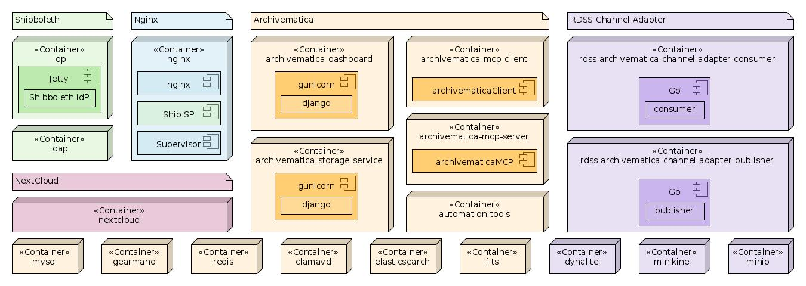

Docker-Compose Services
========================

We use `docker-compose` to orchestrate multiple services so that together they combine to provide our preservation solution platform, including Archivematica, NextCloud and supporting services, such as database backend, authentication, etc.

The following diagram gives an overview of the deployed service containers, grouped together to show how they are related logically.

In the above, the main Archivematica services are highlighted in orange. The services related to Shibboleth are in green, whilst the RDSS-specific containers are highlighted in purple. The NextCloud service is highlighted in pink. The nginx service that fronts it all is highlighted in blue. Where relevant the components deployed into each container are shown; for base services this is omitted.

Some of these containers are required for local development only. In a production deployment, the `dynalite`, `minikine` and `minio` containers would be replaced with connections to actual DynamoDB, Kinesis and S3 services in an AWS environment. Similarly, if the Shibboleth SP in the `nginx` container is configured to use an external IdP then the `idp` and `ldap` containers would become unnecessary.

External Volumes
-----------------

To allow Archivematica and NextCloud to interact and share data with other systems in the environment, some volumes are marked as `external`. These must be created prior to starting the docker containers.

| Volume | Description |
|---|---|
| `rdss_am-autotools_data` | Used to store data and state for the Automation Tools. |
| `rdss_am-pipeline_data` | Used to store data shared across Archivematica components. Also used by external systems to input data to Archivematica, and to retrieve outputs from Archivematica (`www/AIPsStore` and `www/DIPsStore`). |
| `rdss_am-ss-location-data` | Used to provide data storage for the Storage Service. Making this external allows other systems to input data into Archivematica. |
| `rdss_am-ss-staging-data` | Used to provide data storage for the Storage Service. |
| `rdss_arkivum-storage` | Used to access storage on an Arkivum appliance (if available). |
| `rdss_jisc-test-research-data` | Used to access the Jisc RDSS S3 bucket for test research data. |
| `rdss_minio_export_data` | Expose the `/export` folder that Minio uses to store its data |
| `rdss_nextcloud-data` | Used to store data and state for NextCloud. |
| `rdss_nextcloud-themes` | Used to store "themes" for NextCloud. |

### Creating External Volumes

To create volumes for directories on the local machine use

	sudo make create-volumes

The reason for using `sudo` is because some of the volume directories may need their permissions changed, so that they are owned by the `333` user that Archivematica uses for its data.

The parameters for the volumes created are as follows, and may be overridden via Makefile arguments:

| Parameter | Description | Default |
|---|---|---|
| `AM_AUTOTOOLS_DATA` | Path on the docker host to use for Automation Tools data and state. | `/tmp/rdss/am-autotools-data` |
| `AM_PIPELINE_DATA` | Path on the docker host to use for Archivematica's `sharedDirectory` pipeline data. | `/tmp/rdss/am-pipeline-data` |
| `ARK_STORAGE_DATA` | Path on the docker host to use for Arkivum appliance storage. | `/tmp/rdss/arkivum-storage` |
| `ELASTICSEARCH_DATA` | Path on the docker host to use for ElasticSearch data. | `/tmp/rdss/elasticsearch-data` |
| `JISC_TEST_DATA` | Path on the docker host to use for accessing the Jisc RDSS S3 bucket for test research data. | `/tmp/rdss/jisc-test-data` |
| `MINIO_EXPORT_DATA` | Path on the docker host to use for Minio's `/export` folder | `/tmp/rdss/minio-export-data` |
| `MYSQL_DATA` | Path on the docker host to use for MySQL data. | `/tmp/rdss/mysql-data` |
| `NEXTCLOUD_DATA` | Path on the docker host to use use for NextCloud data and state. | `/tmp/rdss/nextcloud-data` |
| `NEXTCLOUD_THEMES` | Path on the docker host to use for NextCloud "theme" data. | `/tmp/rdss/nextcloud-themes` |
| `SS_LOCATION_DATA` | Path on the docker host to use for Archivematica's default location in the Storage Service. | `/tmp/rdss/am-ss-location-data` |
| `SS_STAGING_DATA` | Path on the docker host to use for Storage Service staging data. | `/tmp/rdss/am-ss-staging-data` |

For example, to use remote mounts instead of the default locations

	sudo make create-volumes \
		AM_AUTOTOOLS_DATA=/mnt/nfs/am-autotools-data \
		AM_PIPELINE_DATA=/mnt/nfs/am-pipeline-data \
		ARK_STORAGE_DATA=/mnt/astor \
		ELASTICSEARCH_DATA=/mnt/nfs/elasticsearch-data \
		JISC_TEST_DATA=/mnt/s3/jisc-rdss-test-research-data \
		MINIO_EXPORT_DATA=/mnt/nfs/minio-export-data \
		MYSQL_DATA=/mnt/nfs/mysql-data \
		NEXTCLOUD_DATA=/mnt/nfs/nextcloud-data \
		NEXTCLOUD_THEMES=/mnt/nfs/nextcloud-themes \
		SS_LOCATION_DATA=/mnt/nfs/am-ss-default-location-data \
		SS_STAGING_DATA=/mnt/nfs/am-ss-staging-data

### Destroying External Volumes

After the containers have been torn down using `make destroy`, the external volumes will, by default, remain in place, both as Docker volumes and also in terms of the files remaining intact within the defined locations.

If you wish to destroy the Docker volumes and the data within each of the locations, use the following:

	sudo make destroy-volumes

This must be used with caution, which is why you will be prompted to confirm you really wish to carry out the action. Saying "yes" will remove all traces of your data - so is only suitable for development and test environments or if you **really know what you are doing**!

Service Sets
-------------

There are currently five service sets defined:

1. [qa](qa), which defines the main Archivematica services and supporting web server, db, etc, suitable for use in a qa environment.
1. [dev](dev), which extends `qa` to build the images from local files, rather than expecting to pull existing images.
1. [am-shib](am-shib), which wraps the Archivematica services in the [qa](qa) service set in Shibboleth authentication.
1. [shib-local](shib-local), which provides a local example Shibboleth IdP with backing LDAP directory.
1. [nextcloud](nextcloud), which provides a NextCloud instance, tailored for the RDSS platform.

These service sets are defined by the following `docker-compose` configuration files:

1. [docker-compose.qa.yml](docker-compose.qa.yml)
1. [docker-compose.dev.yml](docker-compose.dev.yml)
1. [docker-compose.am-shib.yml](docker-compose.am-shib.yml)
1. [docker-compose.shib-local.yml](docker-compose.shib-local.yml)
1. [docker-compose.nextcloud.yml](docker-compose.nextcloud.yml)

You can use the [COMPOSE_FILE](https://docs.docker.com/compose/reference/envvars/) environment variable to set which `docker-compose` file or files you wish to use. To just configure the Archivematica dev environment, use

	COMPOSE_FILE=docker-compose.dev.yml docker-compose <compose-args>

To configure Archivematica with local Shibboleth authentication, use

	COMPOSE_FILE=docker-compose.dev.yml:docker-compose.am-shib.yml:docker-compose.shib-local.yml docker-compose \
		<compose-args>

To configure Archivematica with external Shibboleth authentication, and include NextCloud too, use

	SHIBBOLETH_IDP_ENTITY_ID=https://your.domain/idp/shibboleth \
	SHIBBOLETH_IDP_METADATA_URL=https://your.domain/path/to/idp/metadata \
	COMPOSE_FILE=docker-compose.dev.yml:docker-compose.am-shib.yml:docker-compose.shib-local.yml:docker-compose.nextcloud.yml \
		docker-compose \
			<compose-args>

This is quite a mouthful, so there are also Makefiles defined that shortcut some of this for you, for example:

	make all SHIBBOLETH_CONFIG=archivematica NEXTCLOUD_ENABLED=true

This will set `COMPOSE_FILE=docker-compose.dev.yml:docker-compose.am-shib.yml:docker-compose.shib-local.yml:docker-compose.nextcloud.yml` when calling `docker-compose` as part of the build process. To use an external IdP with the `make` command:

	SHIBBOLETH_IDP_ENTITY_ID=https://your.domain/idp/shibboleth \
	SHIBBOLETH_IDP_METADATA_URL=https://your.domain/path/to/idp/metadata \
		make all SHIBBOLETH_CONFIG=archivematica SHIBBOLETH_IDP=external

In future we may make this easier by adding specific support for certain IdPs, for example UKAMF.

In general it is recommended to use the `make` commands rather than call `docker-compose` directly for building, as there are a number of additional tasks that need to be done other than `docker-compose build`.

The exception to this is when using existing container instances. For example:

	COMPOSE_FILE=docker-compose.dev.yml:docker-compose.am-shib.yml docker-compose up -d --force-recreate --no-deps nginx

This will set the right `COMPOSE_FILE` context whilst allowing you to redeploy the `nginx` service, without having to do a full teardown-and-rebuild that `make all` would do.

Service Details
----------------

Details of the services deployed for each service set are in the README for that service set.

* [Archivematica Services](dev/README.md)
* [Shibboleth-enabled Archivematica Services](am-shib/README.md)
* [Local Shibboleth IdP Service](shib-local/README.md)
* [NextCloud Service](nextcloud/README.md)

Building
---------

*Before building, make sure you create the required volumes (see above)*

The Docker Compose build has two modes: `dev` and `qa`.

The `qa` mode will attempt to use pre-built images available from a given registry - you _must_ set the `REGISTRY` environment variable when building in `qa` mode. The `dev` mode does not require a registry, and instead builds each of the images itself. This takes longer, but can be useful if making changes as part of development.

It is also possible to build the `qa` containers and then use `docker-compose` commands to modify or rebuild specific containers in the deployed set. This can be useful when only working on one or two services, since they can be modified individually without having to custom build all the other containers every time, which can save a lot of time.

The `qa` build is the default as this is the quickest and the one used by our default deployment.

### Development Build

To build all containers required to bring up a development version of Archivematica, use

	make all ENV=dev

This will create all the services defined in [docker-compose.qa.yml](docker-compose.qa.yml), which is symlinked by [docker-compose.yml](docker-compose.yml). With `ENV=dev` specified, the docker images will be built by `docker-compose`, rather than expecting the images to exist already. Omitting `ENV=dev` or setting `ENV=qa` will cause the build to fail unless the required images exist (e.g. having been built using the [Ansible playbook](../publish-images-playbook.yml).

There is no Shibboleth integration in this usage. To enable Shibboleth, use this:

	make all ENV=dev SHIBBOLETH_CONFIG=archivematica

This will include additional services defined in [docker-compose.am-shib.yml](docker-compose.am-shib.yml) in addition to those in [docker-compose.dev.yml](docker-compose.dev.yml).

By default this will include the local example Shibboleth IdP in [docker-compose.shib-local.yml](docker-compose.shib-local.yml) too. In future it may be possible to define a different Shibboleth IdP using the `SHIBBOLETH_IDP` environment variable (e.g. to use the UKAMF or UKAMF test IdPs). Alternatively, the `SHIBBOLETH_IDP_ENTITY_ID` and `SHIBBOLETH_IDP_METADATA_URL` environment variables may be used to override this. To use an alternative IdP and prevent the local IdP from being created, use `SHIBBOLETH_IDP=false`.

To enable Shibboleth integration and NextCloud, use

	make all ENV=dev SHIBBOLETH_CONFIG=archivematica NEXTCLOUD_ENABLED=true

After a successful build of the Shibboleth-enabled Archivematica services and NextCloud service you should find you have the following services listed by `make list`:

	              Name                             Command                             State                              Ports
	-----------------------------------------------------------------------------------------------------------------------------------------
	rdss_nginx_1                       /usr/local/bin/ep -v /etc/ ...     Up                                 0.0.0.0:443->443/tcp,
	                                                                                                         0.0.0.0:34312->80/tcp,
	                                                                                                         0.0.0.0:34311->8000/tcp,
	                                                                                                         9090/tcp
	idp.example.ac.uk                  /bin/sh -c bootstrap.sh && ...     Up                                 0.0.0.0:4443->4443/tcp, 8443/tcp
	rdss_archivematica-dashboard_1     /bin/sh -c /usr/local/bin/ ...     Up                                 8000/tcp
	rdss_archivematica-mcp-client_1    /bin/sh -c /src/MCPClient/ ...     Up
	rdss_archivematica-mcp-server_1    /bin/sh -c /src/MCPServer/ ...     Up
	rdss_archivematica-storage-        /bin/sh -c /usr/local/bin/ ...     Up                                 8000/tcp
	service_1
	rdss_clamavd_1                     /run.sh                            Up                                 3310/tcp
	rdss_dynalite_1                    node ./dynalite.js                 Up                                 0.0.0.0:34306->4567/tcp
	rdss_elasticsearch_1               /docker-entrypoint.sh elas ...     Up                                 9200/tcp, 9300/tcp
	rdss_fits_1                        /usr/bin/fits-ngserver.sh  ...     Up                                 2113/tcp
	rdss_gearmand_1                    docker-entrypoint.sh --que ...     Up                                 4730/tcp
	rdss_ldap_1                        /container/tool/run                Up                                 389/tcp, 636/tcp
	rdss_minikine_1                    node ./minikine.js                 Up                                 0.0.0.0:34307->4567/tcp
	rdss_minio_1                       /usr/bin/docker-entrypoint ...     Up                                 0.0.0.0:34305->9000/tcp
	rdss_mysql_1                       docker-entrypoint.sh mysqld        Up                                 3306/tcp
	rdss_nextcloud_1                   run.sh                             Up                                 0.0.0.0:8888->8888/tcp
	rdss_rdss-archivematica-channel-   go run main.go consumer            Up                                 0.0.0.0:34314->6060/tcp
	adapter-consumer_1
	rdss_rdss-archivematica-channel-   go run main.go publisher           Up                                 0.0.0.0:33786->6060/tcp
	adapter-publisher_1
	rdss_rdss-archivematica-           go run main.go -addr=0.0.0 ...     Up                                 0.0.0.0:34308->8000/tcp
	msgcreator_1
	rdss_redis_1                       docker-entrypoint.sh --sav ...     Up                                 6379/tcp

Notice that the `idp.example.ac.uk` and `rdss_nginx_1` containers have specific ports exposed - this is because Shibboleth requires well-known URLs for the Service Provider and Identity Provider.

### QA Build

To build all containers required to bring up a development version of Archivematica, use

	make all REGISTRY=localhost:5000/
	
You should replace `localhost:5000/` with whatever registry address you wish to use, but if you've followed the advice in the [main README documentation](../README.md) and are using a local `registry` Docker container, this will be the correct value.

### Customising The Build

If you wish to change the ports used to something other than the default then you can change them using the environment variables defined in the [.env](.env) file in this folder, which is used by `docker-compose` during the build, or by overriding them via environment variables:

	NGINX_EXTERNAL_PORT=3443 make all SHIBBOLETH_CONFIG=archivematica

You can also change the domain name, by setting the `DOMAIN_NAME` environment variable. This can be done in the [.env](.env) file, or on the command line:

	DOMAIN_NAME=my.edu make all SHIBBOLETH_CONFIG=archivematica

The above would cause all containers and services to use the `my.edu` domain instead, including LDAP records and SSL certificates. Remember to update `/etc/hosts` on the docker host if you used the example entries above, so that the domain names in the FQDN match too.

Other Commands
---------------

Here are some other `make` commands other than `make all` that may be useful when working with these`docker-compose` configurations. These are designed to make it easier to ensure that the right context is available when using multiple configurations, such as when running with `SHIBBOLETH_CONFIG=archivematica`.

| Command | Description |
|---|---|
| `make clean` | Remove all build-generated files. |
| `make destroy` | Tear down all running containers for the configured compose set. |
| `make list` | List all running containers (using `docker-compose ps`) |
| `make watch` | Watch logs from all containers |
| `make watch-idp` | Watch logs from the [idp](shib-local/idp) container, if present |
| `make watch-idp` | Watch logs from the `nginx` container |

Remember to append the `SHIBBOLETH_CONFIG` argument to the above commands if `make all` was run with this set, otherwise the `docker-compose` context won't be resolved properly (this is required for the `watch-idp` command).

Makefile Variables
-------------------

The following makefile variables are supported by this build, in addition to those described above.

| Variable | Description |
|---|---|
| `GENERATE_SSL_CERTS` | Whether or not to auto-generate SSL keys and certificates for the [am-shib](am-shib) and [shib-local](shib-local) container sets. Default is `true`, if set to `false` then you must provide the key and certificate files using the defined environment variables described in those modules' readme documentation. |
| `NEXTCLOUD_ENABLED` | Whether or not to include the NextCloud service in the deployed containers. Default is `false`. Set to `true` to enable. |
| `SHIBBOLETH_CONFIG` | The Shibboleth profile to use. Currently only `archivematica` is supported. Default is undefined, causing no Shibboleth support to be enabled. |
| `SHIBBOLETH_IDP` | The shibboleth IdP profile to use. Currently only `local` is supported, which is the default if `SHIBBOLETH_CONFIG` is set. Setting to another value will prevent the local Shibboleth IdP ([shib-local](shib-local)) from being included. |

Environment Variables
----------------------

The following environment variables are supported by this build.

| Variable | Description |
|---|---|
| `DOMAIN_NAME` | The domain name to use when configuring Shibboleth. |
| `REGISTRY` | The name and port of the Docker registry to pull our applications' images from. Default is `''`, which means that no Docker registry will be used; all images will be expected to be local. This is mostly for use in QA deployments, where we deploy a Docker registry server on `localhost:5000/`. |
| `VOL_BASE` | The path to use as the base for specifying volume paths in `docker-compose` configurations. Default is `'.'`, which gets correctly interpreted when build machine is the same as docker host. When deploying to a remote docker host (e.g. via `docker-machine`), this must be set to the path of the equivalent base path on the docker host, e.g. `/home/ubuntu/rdss-archivematica/compose` if using a standard Ubuntu AMI on EC2). |

See also the individual [idp](shib-local/idp), [ldap](shib-local/ldap) and [nginx](am-shib/nginx) services for additional environment variables used by those specific services.

Secrets
--------

Some of the configuration of these services may be considered "secret", i.e. data that should't be committed to a source control system. This includes, but is not limited to, key and certificate files used by SSL and Shibboleth services to secure and verify connections and communication.

These secrets are created by the `create-secrets.sh` script in the relevant folder for each service. This script is run as part of the `make` build process.

Currently they are stored as normal files and mounted to the `/secrets` directory within each service container, but in future this may change to use the [Docker Secrets](https://docs.docker.com/engine/swarm/secrets/) functionality, or its equivalent for other platforms (e.g. [Vault](https://www.vaultproject.io/) for AWS deployment).
